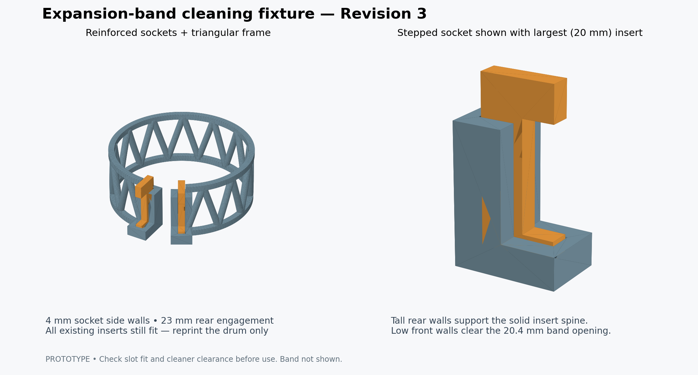

# Expansion-band cleaning fixture — Revision 3

A printable open drum for holding a detached expansion watch band stretched during cleaning. Two interchangeable slotted inserts let the narrow band body pass while retaining the wider expanded end fittings.

## What changed in Revision 3

- Stepped sockets support **23 mm of the solid rear spine**, up from 3 mm.
- Rear socket walls rise to **26 mm**; the front remains **6 mm** high.
- Side walls increase from **3 to 4 mm**, with **2.5 mm** end walls.
- The largest insert has a **20.4 mm opening**. Its lower edge sits at **6.6 mm** when fully seated, leaving **0.6 mm** above the front socket walls. The tall rear walls end **1.5 mm behind** the opening.
- CAD intersections confirm that neither the largest insert nor its band opening overlaps the socket. Existing inserts remain compatible; only the drum needs a new print.

## Retained from Revision 2

- Both insert sockets move **4 mm radially outward**. Retaining tips extend **6 mm beyond the support radius**.
- Thin vertical bars become **4.2 mm diagonal braces**, forming twelve open triangular bays. The supports cross the band at changing positions rather than following a link gap for its full width.
- Both rims are thicker: **3.6 mm radial thickness × 3.5 mm height**.
- The original inserts still fit. **Only the drum needs to be reprinted.**

## Print files

| File | Purpose |
| --- | --- |
| [drum.stl](drum.stl) | Updated drum; print upright as supplied |
| [slot_inserts_19mm.stl](slot_inserts_19mm.stl) | Optional pair for a 19 mm band body; 19.4 mm clear opening |
| [slot_inserts_16-20mm.stl](slot_inserts_16-20mm.stl) | Original ten inserts, two of each size; compatible with all revisions |
| [expansion_band_stretcher.scad](expansion_band_stretcher.scad) | Editable OpenSCAD model, default assembly uses 19 mm inserts |
| [README.txt](README.txt) | Detailed assembly, printing and sizing instructions |

The support cylinder is 88.20 mm in diameter and 34 mm tall, with a 30° loading gap. The overall base footprint is **96.77 × 88.20 mm** including the sockets. Allow extra space for the band and its end fittings.

The reference support arc is 254 mm (10 inches). The outward socket position and band thickness affect actual stretched length; do not force a band to reach this size. Set `band_path` in OpenSCAD to change the drum diameter.

## Assembly and printing

Seat two matching inserts in the sockets with their slot mouths facing outward. Pass the band body into the slots, keeping the wider end fittings on the loading-gap side, and wrap the band along the long outside arc. Check that the fittings overlap both retaining walls.

Start with 0.2 mm layers, four perimeters and solid inserts. Inspect the upper-rim bridges (approximately 20 mm between peaks) and brace junctions in the slicer. Add support if needed for your printer. Smooth all band-contact edges and choose a filament compatible with the cleaning bath temperature and solution.

The 19 mm insert has 0.4 mm total added clearance. The expanded end fitting must be wider than 19.4 mm to be retained.

## Validation

Exported STLs passed closed edge-manifold and connected-component checks, the largest insert and band-opening clearances were checked with CAD intersections, and the assembly preview was inspected. Revision 3 is not physically tested yet; improvements in strength and cleaning performance need confirmation in use. [Mesh check results](mesh_check.json).
