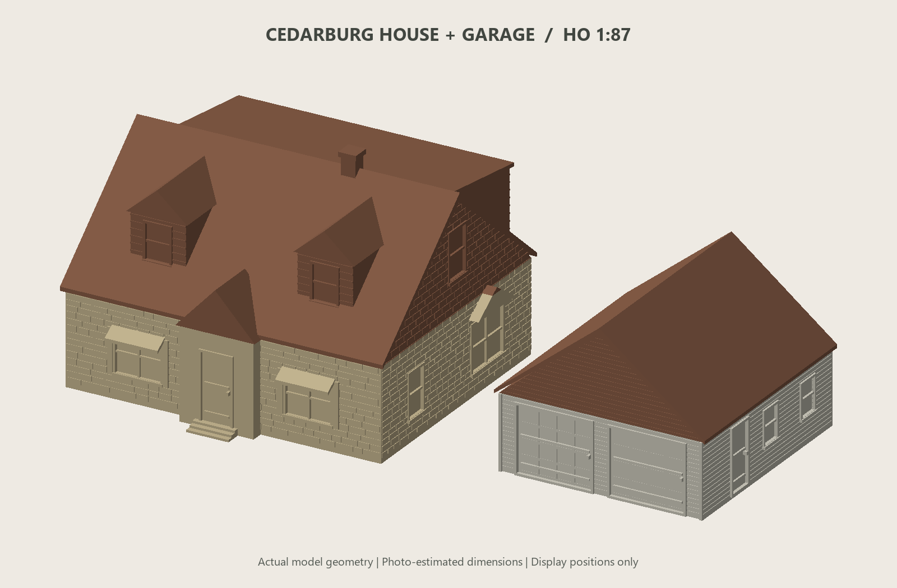
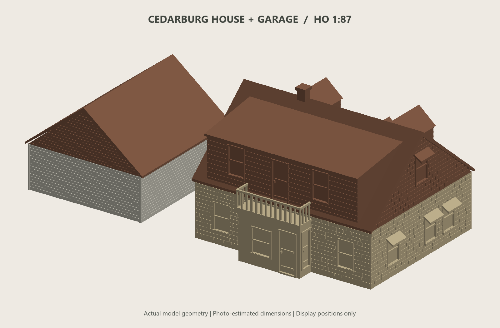

# Cedarburg House and Garage — HO Scale

Photo-interpreted house and detached garage at **1:87**, designed for the Prusa MK3.5. This version includes the rear entry door directly beneath the balcony.

## Download and print

- [Complete print kit ZIP](Cedarburg_HO_Print_Kit.zip)
- [Walls plate](01_walls_plate.3mf)
- [Roofs plate](02_roofs_plate.3mf)
- [Individual STL files](STL/)
- [Printing and assembly guide](PRINT_GUIDE.md)

The 3MF files contain geometry without printer or filament settings. Select the matching printer, nozzle, and filament profile in PrusaSlicer. Import the models in millimetres at **100%**; they are already HO size.

| Assembled model | Approximate overall size |
| --- | --- |
| House, including balcony, awnings, and chimney | 128 × 121 × 85 mm |
| Garage | 80 × 87 × 61 mm |

Dimensions were estimated from street and satellite screenshots, using assumed garage-door dimensions as a rough scale reference. They are not surveyed measurements. Windows and doors are closed, recessed surfaces for painting; small details are thickened for FDM printing.

## Files and source

The four numbered STLs are the printable wall and roof parts. The two assembled-reference STLs show the combined buildings and are not additional kit parts. Original model filenames are preserved.

- `build_model.py` — procedural model generator and preview renderer.
- `dimensions.json` — editable scale and assumed building dimensions.
- `requirements.txt` — Python dependencies; install with `python -m pip install -r requirements.txt`.
- `assembly_coordinates.json` — original coordinates for digital reassembly.
- `mesh_validation.json` and `slicing_validation.json` — recorded validation results.

Run `python build_model.py` from this project to regenerate the model files and previews. Rendering currently uses Windows Segoe UI font paths; change them for another OS. The downloadable ZIP is a snapshot of the current files and is not rebuilt by that command.

## Validation

The four print parts and two assembled-reference STLs passed watertightness, consistent-winding, positive-volume, and single-component checks. All four print parts were successfully sliced in PrusaSlicer 2.9.4 with the MK3.5 0.4 mm profile. Use **snug supports for the house roof**; its organic-support attempt reported branch errors. See the print guide for details and the settings used.

A 0.25 mm nozzle is optional, but that configuration has not been slice-tested. No physical test print has been made. Machine-specific validation G-code, runtime dependencies, and original reference screenshots are not included in this project.

## Rear view

[Exploded assembly preview](preview_exploded.png)

Added to this repository on 2026-09-11.
