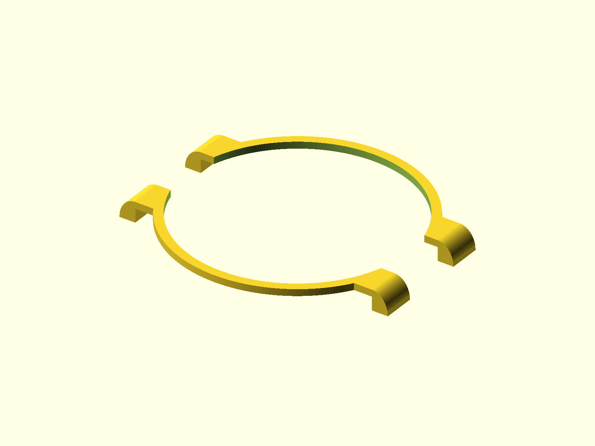

# Hoyer 6000 series bezel

A two-piece replacement bezel modeled for the Hoyer 6000-series watch case. The two mirrored halves wrap around most of the dial while leaving a 9.3 mm opening between them at each side.

## Files

| File | Purpose |
| --- | --- |
| [watch_bezel_half.stl](watch_bezel_half.stl) | Printable half; print two copies |
| [watch_bezel_assembly.stl](watch_bezel_assembly.stl) | Reference assembly showing both mirrored halves |
| [watch_bezel.scad](watch_bezel.scad) | Editable parametric OpenSCAD source |
| [mesh_check.json](mesh_check.json) | Digital mesh and dimension validation |

## Nominal dimensions

| Measurement | Value |
| --- | ---: |
| Circular opening diameter | 32.9 mm |
| Circular rim outside diameter | 35.5 mm |
| Terminal shoulder span | 35.5 mm |
| Overall tip-to-tip span | 40.260 mm |
| Side separation | 9.3 mm |
| Rim width | 1.3 mm |
| End width along the wrist | 4.75 mm |
| Main body thickness | 1.0 mm |
| Maximum height | 3.0 mm |

## Printing and fit

Import the STL in millimeters at 100% scale. Print two copies of `watch_bezel_half.stl`; rotate one half 180 degrees around the dial during assembly. The assembly STL is supplied for reference and is not required for printing.

Inspect the sliced geometry before printing and test the pieces against the watch without forcing them into place. The latest 32.9 mm opening and 35.5 mm terminal-shoulder revision has passed digital mesh and dimensional checks, but its physical fit has not yet been confirmed.

## Validation

Both exported STLs are closed, consistently wound meshes. The printable half is one connected watertight component. The assembly contains two watertight components separated by 9.3 mm. The rounded terminal transitions remain continuous to the -2.0 mm floor, and the terminal shoulders measure exactly 35.5 mm apart.

## License

Copyright © 2026 Beau Gosse. This model is distributed under CC BY-NC-SA 4.0; see `LICENSE.txt`.
