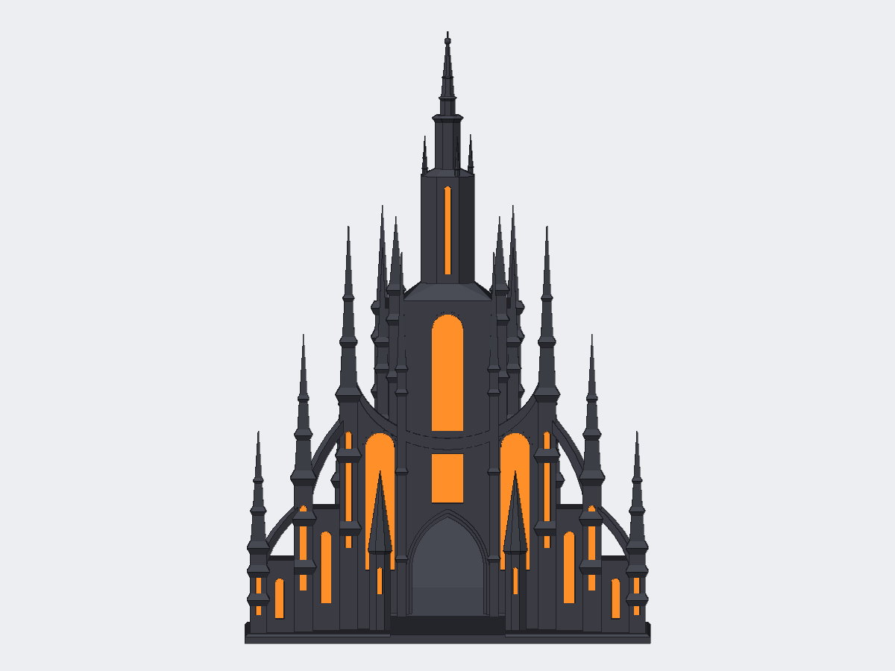

# Kredik Shaw dice tower

An unofficial fan model of Kredik Shaw, the Lord Ruler's palace in Luthadel from Brandon Sanderson's *Mistborn*, built as a dice tower for a Prusa MK3/MK3S. Dice drop through the open roof of the hall at the back, bounce off two baffles, run down a ramp through a tunnel under the central tower, and roll out of the front gate into a separate courtyard tray.

The shape follows the published *Mistborn* artwork: a tall central tower with a long glowing window, a bowl-shaped curve across the facade, and slender towers that step down and forward on each side, joined by steep flying buttresses.

## Files

| File | What it is | Size (mm) |
| --- | --- | --- |
| [kredik_shaw_tower.stl](kredik_shaw_tower.stl) | Main body with the dice path inside | 180 × 148 × 187 |
| [kredik_shaw_spire.stl](kredik_shaw_spire.stl) | Top of the central tower; fits onto the square peg | 24 × 24 × 113 |
| [kredik_shaw_tray.stl](kredik_shaw_tray.stl) | Courtyard tray that catches the dice | 178 × 122 × 56 |
| [kredik_shaw_window_tiles.stl](kredik_shaw_window_tiles.stl) | 27 flat window tiles, 1.2 mm thick | 157 × 185 × 1.2 |
| [kredik_shaw_dice_tower.scad](kredik_shaw_dice_tower.scad) | Editable parametric OpenSCAD source | |
| [mesh_check.json](mesh_check.json) | Mesh and size validation | |
| [build_model.py](build_model.py) | Regenerates the STLs from the source | |

Assembled, the tower stands 270 mm tall. The tray sits in front of it with its back wall against the front edge of the tower's base, so the gap in the tray wall lines up with the gate.

## Printing

Print every part in the orientation it is saved in. None of them needs supports. Leave supports off for the tower: the two baffles inside span between the shaft walls and print as bridges, and supports placed there could not be removed.

Estimates from PrusaSlicer 0.20 mm SPEED @MK3, 15% infill, Prusament PLA:

| Part | Time | Filament |
| --- | ---: | ---: |
| Tower | 27 h 22 m | 349 g |
| Spire | 1 h 25 m | 11 g |
| Tray | 4 h 44 m | 75 g |
| Window tiles | 57 m | 12 g |

For finer spires, use the 0.15 mm QUALITY profile; the tower then takes about 45 hours.

## Windows

Every window on the model is a 1.2 mm pocket. Print the window tiles flat in a glowing colour (translucent orange or red PLA works well) and glue each into its pocket. The tiles are 0.15 mm smaller all round than their pockets. This keeps colour changes out of the main print, so there is no purging on every layer. Painted pockets work too.

## Dice

The shaft is 50 × 60 mm inside, and the gaps at the baffle tips are 26 mm, so standard polyhedral dice, including a 20–22 mm d20, pass through. The exit tunnel and gate are 32 mm wide.

## Editing

Open `kredik_shaw_dice_tower.scad` in OpenSCAD and set `part` to `tower`, `spire`, `tray`, `windows` or `assembled`. Useful settings:

- `split_spire` and `spire_top`: set `split_spire = false` and `spire_top = 205` to print the tower in one piece.
- `side_towers`: position, height and spire length of each stepped side tower.
- `bowl_zc`, `bowl_a`, `bowl_b`: the bowl-shaped curve across the front.
- `shaft_w`, `shaft_d`, `baffle_*`: the dice path. Checks in the file stop the render if a change would leave too little room for dice.

`build_model.py` exports the STLs. It needs `openscad`, `numpy` and `manifold3d`; newer OpenSCAD releases can also export each part directly.

## Status

Digitally validated; not yet test-printed. All four STLs are manifold and fit the MK3 bed, and the slicer estimates above come from PrusaSlicer's MK3S profile. The peg fit, the glued window tiles and the dice path have not been tried on a physical print.

## Fan work

This is an unofficial fan model. *Mistborn*, Kredik Shaw and Luthadel belong to Brandon Sanderson and Dragonsteel Entertainment, who have not sponsored, authorized or endorsed it.

## License

Copyright © 2026 Beau Gosse. This model is distributed under CC BY-NC-SA 4.0; see `LICENSE.txt`.
