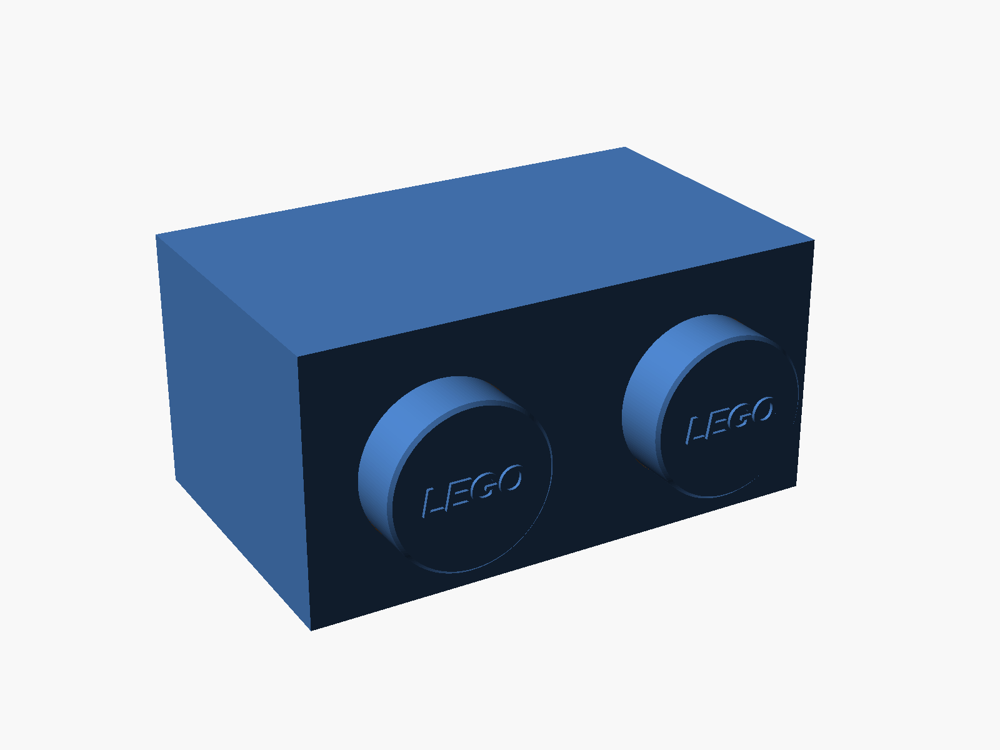

# LEGO-style brick wall shelf

A wall shelf shaped like a real 1×2 or 1×4 LEGO brick, scaled up to 245 mm wide so it fills a Prusa MK3/MK3S bed. The brick hangs with its studs facing into the room, and its flat side becomes the shelf top for displaying LEGO builds. The underside is open, which saves plastic and lets you see the screws while hanging it.

## Files

| File | Purpose |
| --- | --- |
| [lego_brick_shelf_1x2_body.stl](lego_brick_shelf_1x2_body.stl) | 1×2 shelf body, oriented for printing |
| [lego_brick_shelf_1x2_studs.stl](lego_brick_shelf_1x2_studs.stl) | Two studs for the 1×2 body |
| [lego_brick_shelf_1x4_body.stl](lego_brick_shelf_1x4_body.stl) | 1×4 shelf body, oriented for printing |
| [lego_brick_shelf_1x4_studs.stl](lego_brick_shelf_1x4_studs.stl) | Four studs for the 1×4 body |
| [lego_brick_shelf.scad](lego_brick_shelf.scad) | Editable parametric OpenSCAD source |
| [mesh_check.json](mesh_check.json) | Digital mesh and dimension validation |

## Proportions

Every dimension comes from a real LEGO brick, scaled so the length is 245 mm. A 1×N brick is N × 8 − 0.2 mm long, 7.8 mm wide, and 9.6 mm tall. Studs are 4.8 mm in diameter and 1.7 mm high, set 3.9 mm in from each end on an 8 mm pitch.

| Measurement | 1×2 | 1×4 |
| --- | ---: | ---: |
| Width | 245 mm | 245 mm |
| Shelf top depth | 148.9 mm | 74.0 mm |
| Front height | 121.0 mm | 60.1 mm |
| Depth including studs | 176.8 mm | 87.8 mm |
| Stud diameter | 74.4 mm | 37.0 mm |
| Screw spacing | 124.1 mm | 184.9 mm |
| Screw height above bottom edge, hung | 60.4 mm | 36.0 mm |

Walls are 2 mm thick; the back wall is 3 mm because it carries the screw load.

## Printing

Print the body with the shelf top face-down on the bed and the open side up, exactly as the STL is oriented. It needs no supports and has no bridges. Print the studs flat on their backs, logo up. Each stud has a 1 mm locating plug that drops into a matching recess on the front; glue it in with CA glue. Printing the studs in a different color works well.

Estimates from PrusaSlicer 0.20 mm SPEED @MK3, 15% infill, Prusament PLA:

| Part | 1×2 | 1×4 |
| --- | ---: | ---: |
| Body | 18 h 0 m · 308 g | 7 h 52 m · 128 g |
| Studs | 3 h 9 m · 74 g | 1 h 31 m · 26 g |

## Mounting

The keyholes take pan-head screws with heads up to about 9.5 mm across and shanks up to 4.5 mm (#8 or 4 mm). Drive two screws at the spacing above, leaving about 3.5 mm between the wall and the underside of each head. Pass the heads through the round holes from behind, then lower the shelf so the shanks ride up into the slots. Use wall anchors where there is no stud.

## Editing

Open `lego_brick_shelf.scad` in OpenSCAD. Set `studs` to 2 or 4 and `part` to `body` or `studs`, then render (F6) and export. `wall`, `back_wall`, `width`, and the keyhole sizes are all adjustable. Set `part = "assembled"` and `print_orientation = false` to preview the finished shelf as it hangs.

## Status

Digitally validated; not yet test-printed. All four STLs are watertight with consistent winding.

## Trademark

LEGO® is a trademark of the LEGO Group, which does not sponsor, authorize, or endorse this model.

## License

Copyright © 2026 Beau Gosse. This model is distributed under CC BY-NC-SA 4.0; see `LICENSE.txt`.
